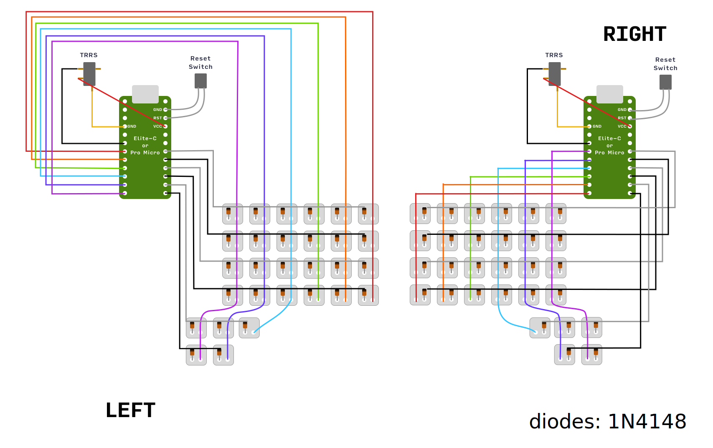
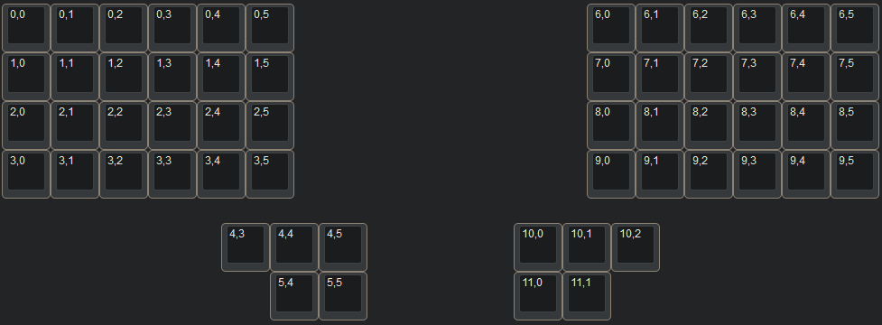

# keyboards

QMK keyboards

# Usage

Before use make sure QMK is installed. [QMK Setup guide.](https://docs.qmk.fm/#/newbs_getting_started)

Use **./keyboards** script or simply copy needed keyboard folder to **qmk_firmware/keyboards/biocoder/***

```console
Usage: keyboards [<command>] [<keyboard>] [<keymap>]

Commands:
    update              update git submodules (qmk_firmware)

    lint <keyboard> [<keymap>]                          lint specified firmware
    compile <keyboard> [<keymap>]                       compile specified firmware
    flash <keyboard> [<keymap>] [--left|--right]        flash specified firmware, eeprom left/right available (only for 'caterina', 'atmel-dfu')
```

# Scylla

[Scylla](https://github.com/Bastardkb/Scylla) case with pro micro

[VIA](https://usevia.app/) keymap supported: 
```console
./keyboards flash scylla via
```

### Wiring


### Layout

