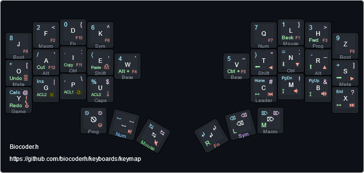

[](https://github.com/biocoderh/keyboards/actions/workflows/keymap-lint.yml)

# Keymap

QMK keymap



Notes:
 - On keycap bootom placed Mod-Tap and Tap-Hold actions.
 - Mod-Tap work only on layers: Base, Num and Fn left side.
 - Tap-Hold layers and boot work on all layers except game.
 - Hold again Tap-Hold layer to return base.

[Data set used to build layout.](https://github.com/biocoderh/keyboards/tree/master/layouts/data)

### Game mode


### Runglish layout example


[Runglish layout.](https://github.com/biocoderh/keyboards/tree/master/layouts/Runglish)

# Porting

0. Copy **keymap** folder to **qmk_firmware/users/biocoderh**.
1. Create **biocoderh** folder in **qmk_firmware/keyboards/<keyboard_path>/keymaps/**.
2. Create **keymap.c** file.
3. Create **config.h** file like shown in example:

**XXX** - would be ignored\
**LAYOUT_split_4x6_5** - it's your board keymap.

```c
#pragma once

#define XXX KC_NO

#define LAYOUT_biocoderh( \
         K00, K01, K02, K03,                          K04, K05, K06, K07, \
         K08, K09, K10, K11, K12,                K13, K14, K15, K16, K17, \
         K18, K19, K20, K21,                          K22, K23, K24, K25, \
                   K26, K27, K28,                K29, K30, K31 \
) \
LAYOUT_split_4x6_5( \
    XXX, XXX, XXX, XXX, XXX, XXX,                XXX, XXX, XXX, XXX, XXX, XXX, \
    XXX, K00, K01, K02, K03, XXX,                XXX, K04, K05, K06, K07, XXX, \
    XXX, K08, K09, K10, K11, K12,                K13, K14, K15, K16, K17, XXX, \
    XXX, K18, K19, K20, K21, XXX,                XXX, K22, K23, K24, K25, XXX, \
                   K26, K27, XXX,                XXX, K30, K31, \
                        K28, XXX,                XXX, K29 \
)
```

4. Finally build and flash firmware:

```console
qmk flash -kb <keyboard> -km biocoderh
```

or with **../keyboards** script:

```console
./keyboards flash scylla biocoderh
```


# Features

## Custom

To redefine macro buttons behavior use following example:

```c
// Process keycodes: QK_USER_0 ... QK_USER_31
void custom_user(uint16_t keycode, keyrecord_t *record) {
    if (record->event.pressed) {
        switch(keycode) {
            case QK_USER_12:
            case QK_USER_13:
                process_tap(QK_BOOT, record);
        }
    }
}

```

and for leader sequence:

```c
void custom_leader(void) {
    if (leader_sequence_two_keys(KC_D, KC_D)) {
        tap_code16(KC_END);
        tap_code16(S(KC_HOME));
        tap_code16(KC_BSPC);
    }
}
```

## Common

By default qmk os detecton should chouse os, but if you want to define it by yourself use following example:

```c
#define WINDOWS
#define MACOS
```

Custom features uses qmk **process_record** handling, to prevent looping check **process_in_loop** before using any methods.

```c
bool process_key(uint16_t keycode, keyrecord_t *record);
bool process_tap(uint16_t keycode, keyrecord_t *record);

bool process_record_user(uint16_t keycode, keyrecord_t *record) {
    if (process_in_loop) return true;

    ...
}
```

## OS Keys

OS specific key rebinder in runtime.

Default bindings:

```c
#define OS_KEYS_WIN_UNDO C(KC_Z)
#define OS_KEYS_WIN_CUT C(KC_X)
#define OS_KEYS_WIN_COPY C(KC_C)
#define OS_KEYS_WIN_PASTE C(KC_V)
#define OS_KEYS_WIN_AGIN C(KC_Y)

#define OS_KEYS_MAC_UNDO LCMD(KC_Z)
#define OS_KEYS_MAC_CUT LCMD(KC_X)
#define OS_KEYS_MAC_COPY LCMD(KC_C)
#define OS_KEYS_MAC_PASTE LCMD(KC_V)
#define OS_KEYS_MAC_AGIN SCMD(KC_Z)
```

To use **Auto-Shift**:

```c
#define OS_KEYS_AUTO_SHIFT
```

## Tap-Hold

Process keycode as usual or do something else if hold term achived.
By **process_record** handling all qmk features should be available.

```c
bool process_tap_hold(uint16_t keycode, keyrecord_t *record, uint16_t holdKeycode, uint16_t term);
bool process_tap_hold_two(uint16_t keycode, keyrecord_t *record,
    uint16_t holdKeycode1, uint16_t term1,
    uint16_t holdKeycode2, uint16_t term2
);

bool process_tap_hold_layer(uint16_t keycode, keyrecord_t *record, uint16_t layer, uint16_t term);
```

in **process_record_user**:

```c
    // Keycode specific.
    switch(keycode) {
        case TH_CAPS: return process_tap_hold_two(keycode, record, CW_TOGG, TAP_HOLD_CAPS_WORD_TERM, KC_CAPS, TAP_HOLD_CAPS_LOCK_TERM);
        ...
    }

    // This would be available on all layers.
    switch (keycode_at_keymap_location(L_BASE, record->event.key.row, record->event.key.col)) {
        case TH_NUM: return process_tap_hold_layer(keycode, record, L_NUM, TAP_HOLD_LAYER_TERM);
        ...
    }
```
