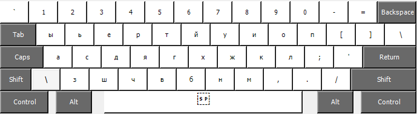
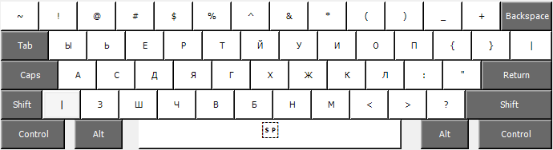
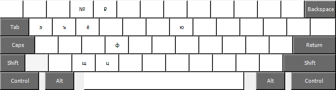

# Runglish layout

US - RU direct binding layout.

Why?

Changing main layout make adapting process harder X2.\
Also default russian layout uses symbol keys as characters which very annoying sometimes.\
So decision is pretty simple: rebind to main layout similar keys and keys which not fit goes to AltGr layer.

Note: on qwerty layout it might looks strange, but in my case with full custom main layout it lays almost perfectly.

### Shifted

### AltGr

