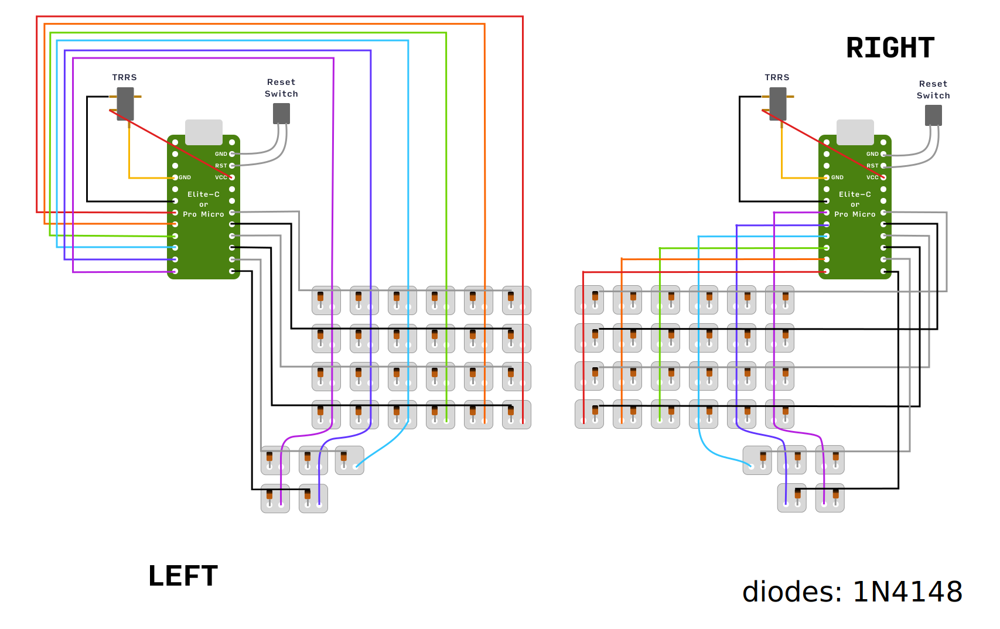
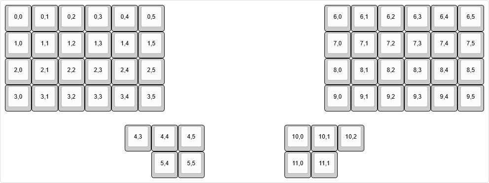

# Scylla

[Scylla](https://github.com/Bastardkb/Scylla) case with pro micro

[VIA](https://usevia.app/) keymap supported:
```console
./keyboards flash scylla via
```

## Flash

Use **./keyboards** scripts:
```console
./keyboards flash scylla default
```

Or alternativley copy **scylla** folder to **qmk_firmware/biocoderh/scylla** and use qmk directly:
```console
qmk flash -kb biocoderh/scylla -km default -bl avrdude-split-left
qmk flash -kb biocoderh/scylla -km default -bl avrdude-split-right
```

### Wiring


### Matrix

